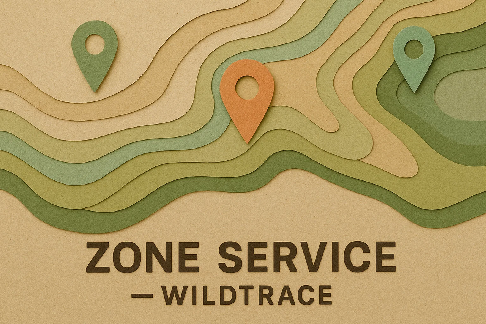

<div style="text-align: center;">
  </div>

# WildTrace – Zone Service

## Descripción del microservicio

Este microservicio forma parte del sistema **WildTrace**, una aplicación basada en microservicios para el registro de avistamientos de fauna en zonas naturalizadas.

`zone-service` gestiona las zonas geográficas donde se observan las especies. Cada zona incluye su nombre, coordenadas geográficas, y se asocia con una imagen de mapa generada dinámicamente a partir de las coordenadas.

Este servicio ofrece:
- CRUD completo de zonas naturalizadas
- Validaciones con DTOs y Swagger/OpenAPI
- Cobertura completa con tests unitarios, de integración y funcionales

---

### Entidad principal: `Zone`

```text
Zone
 ├── Long zoneId
 ├── String zoneName
 ├── Double latitude
 ├── Double longitude
```

Y el DTO de respuesta incluye:

```text
ZoneResponseDTO
 ├── Long zoneId
 ├── String zoneName
 ├── Double latitude
 ├── Double longitude
 ├── String mapImageUrl (generada dinámicamente)
```

---

## Setup local (instalación)

1. **Clonar el repositorio del microservicio:**
```bash
git clone https://github.com/dsuarezg/WildTrace.git
cd WildTrace/zone-service
```

2. **Configurar base de datos (MySQL recomendado)**

```sql
CREATE DATABASE wildtrace_zones;
```

3. **`application.properties` recomendado:**
```properties
spring.application.name=zone-service

spring.datasource.driver-class-name=com.mysql.cj.jdbc.Driver
spring.datasource.url=jdbc:mysql://localhost:3306/wildtrace_zones
spring.datasource.username=username
spring.datasource.password=password

spring.jpa.hibernate.ddl-auto=update
spring.jpa.show-sql=true

server.port=8082
```

4. **Construir y ejecutar el proyecto**
```bash
mvn clean install
mvn spring-boot:run
```

5. **Acceder a Swagger (API Docs):**
```
http://localhost:8082/swagger-ui/index.html
```

---

## Tecnologías utilizadas

- Java 21
- Spring Boot 3.4.6
- Spring Data JPA
- MySQL / MariaDB
- Maven
- Swagger / OpenAPI 3
- JUnit 5 / Mockito / MockMvc
- ArchUnit
- JaCoCo (para cobertura de tests)
- Lombok

---

## Cobertura de tests (JaCoCo)

Ejecutar:
```bash
mvn clean verify
```
Informe generado en:
```
target/site/jacoco/index.html
```
Cubre:
- 100% del servicio (`ZoneService`)
- 100% del controlador (`ZoneController`)
- 100% de los endpoints funcionales y errores comunes

| GROUP         | PACKAGE                                 | CLASS                                   | INSTR_MISSED | INSTR_COVERED | % INSTR | LINE_MISSED | LINE_COVERED | % LINE | METHOD_MISSED | METHOD_COVERED | % METHOD |
|---------------|-----------------------------------------|-----------------------------------------|--------------|---------------|---------|-------------|--------------|--------|---------------|----------------|----------|
| zone-service  | org.ironhack.zoneService.mapper         | ZoneMapper                              | 3            | 40            | 93.0%   | 1           | 11           | 91.7%  | 1             | 2              | 66.7%    |
| zone-service  | org.ironhack.zoneService.service        | ZoneService                             | 0            | 93            | 100.0%  | 0           | 21           | 100.0% | 0             | 9              | 100.0%   |
| zone-service  | org.ironhack.zoneService.config         | OpenApiConfig                           | 0            | 8             | 100.0%  | 0           | 2            | 100.0% | 0             | 2              | 100.0%   |
| zone-service  | org.ironhack.zoneService.config         | OpenApiConfig.new WebMvcConfigurer() {...} | 0         | 22            | 100.0%  | 0           | 5            | 100.0% | 0             | 2              | 100.0%   |
| zone-service  | org.ironhack.zoneService.controller     | ZoneController                          | 0            | 45            | 100.0%  | 0           | 10           | 100.0% | 0             | 7              | 100.0%   |
| zone-service  | org.ironhack.zoneService.exception      | ZoneNotFoundException                   | 4            | 5             | 55.6%   | 2           | 2            | 50.0%  | 1             | 1              | 50.0%    |
| zone-service  | org.ironhack.zoneService                | ZoneServiceApplication                  | 5            | 3             | 37.5%   | 2           | 1            | 33.3%  | 1             | 1              | 50.0%    |
| **Total**     |                                         |                                         | **12**       | **216**       | **94.7%** | **5**      | **52**       | **91.1%** | **3**        | **24**         | **88.9%** |

---

## Estructura de endpoints REST

| Método | Endpoint               | Descripción                     |
|--------|------------------------|---------------------------------|
| GET    | `/api/zones`          | Listar todas las zonas          |
| GET    | `/api/zones/{id}`     | Obtener zona por ID             |
| POST   | `/api/zones`          | Crear nueva zona                |
| PUT    | `/api/zones/{id}`     | Actualizar zona existente       |
| DELETE | `/api/zones/{id}`     | Eliminar zona por ID            |

---

## Buenas prácticas aplicadas

- Uso de DTOs con validación (`jakarta.validation`)
- MapStruct/mapper custom para separar modelo y DTO
- Tests FIRST: rápidos, independientes, repetibles, auto-validables
- Arquitectura en capas validada con `ArchUnit`
- Preparado para integración futura con arquitectura hexagonal (`ports`) y APIs externas (mapas)

---

## Por hacer / ideas futuras

- [ ] Implementar integración real con API de mapas (Mapbox, Google Static Maps)
- [ ] Refactor a arquitectura hexagonal (ports + adapters)
- [ ] Añadir control de versiones (soft deletes o versionado de zonas)
- [ ] Cachear imagenes en base de datos o filesystem
- [ ] Habilitar búsqueda avanzada por radio y filtros
- [ ] Contador de especies observadas por zona

---

Desarrollado con ❤️ para **WildTrace**
